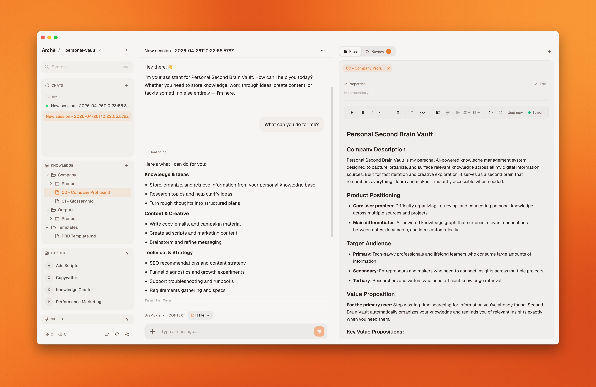

[](https://github.com/peaberry-studio/arche/releases/latest)


# Arche

*An AI-native system where your knowledge, tools, processes, and expert agents work together.*

Arche is an open source AI agent platform for companies or individuals who want to build a shared ecosystem of agents, knowledge, and workflows for their team, or use the same system as a personal second brain.

- 🏢 For companies: build a shared AI-native ecosystem of agents, knowledge, and processes that every member of your team can use.
- 🧠 For personal use: run Arche solo as a local AI-native second brain for notes, docs, and ideas.

From one place, you can run support, copywriting, SEO, marketing, research, requirements, and ops agents. Instead of starting every prompt from zero, you define your products, tone, processes, docs, and source material once. Each agent gets that shared knowledge plus its own isolated workspace, so your AI team stays consistent and useful.

Arche also works with the tools you already use. With dozens of integrations, including Slack, Google Workspace, Linear, Notion, Zendesk, Ahrefs, and Umami, plus support for any compatible remote MCP server, Arche becomes a shared entry point into your digital stack, not just another AI editor.

## See Arche



Arche usually fits one of these patterns:

## What Arche Is For

- 🏢 Teams: run a shared crew of experts for support, copywriting, SEO, marketing, research, requirements, and ops.
- 🔌 Connected stack: plug Arche into Slack, Google Workspace, Linear, Notion, Zendesk, Ahrefs, Umami, and any compatible remote MCP server.
- 🧠 Individuals: use the same system as an AI-native second brain for notes, docs, and ideas.
- 💻 Deployment choice: start on one machine with Desktop or self-host Arche for your whole team.

## How Arche Works

1. Choose a template and the agents you want to run.
2. Add your company or personal knowledge, tone, and working context once.
3. Connect the tools you already use.
4. Let each agent work in its own isolated workspace without losing the shared context.

## Principles

- 🤖 AI-native: your knowledge base is meant to be usable by AI from day one, not bolted on later.
- 🏢 Team-first: Arche is designed around shared context, reusable experts, and repeatable work across a company.
- 🔌 Connected stack: built-in integrations and compatible remote MCP servers let Arche work with the tools you already use.
- 🧩 Specialized agents: support, copywriting, SEO, marketing, research, requirements, and ops can share knowledge without sharing runtime state.
- 🧠 Individual-friendly: the same model also works as a personal second brain on one machine.

## Start Here

| I want to... | Best option |
|--------------|-------------|
| 🏢 Run Arche for a team | [Self-Hosting](#self-hosting) |
| 🧠 Use Arche locally or build a personal second brain | [Desktop App](#desktop-app) |
| 🛠️ Work on the codebase | [Local Development](#local-development) |

## Desktop App

If you want the fastest path, start with the desktop app. It runs on your machine with no server or Docker setup required.

Desktop vault behavior:

- Arche Desktop opens directly into the workspace for the last valid vault.
- If no vault is selected yet, it opens a launcher where you can create or open a vault.
- Each vault is a visible folder that contains its own database, KB repos, runtime state, and secrets.
- Opening another vault launches a separate Electron process and window, similar to Obsidian.

Breaking change:

- Desktop no longer reads or migrates legacy hidden data from `~/.arche` or `~/.arche-opencode`.
- You must create or open a visible Arche vault folder.

### Download

Head to the [latest release](https://github.com/peaberry-studio/arche/releases/latest) and download the installer for your platform:

| Platform | File |
|----------|------|
| macOS (Apple Silicon) | `Arche-arm64.dmg` or `Arche-<version>-arm64-mac.zip` |
| macOS (Intel) | `Arche-x64.dmg` or `Arche-<version>-mac.zip` |

Official GitHub release assets are currently published for macOS only.

Linux and Windows packaging targets exist in `apps/desktop`, but they are not part of the current release workflow or validation matrix, so they should not be documented as supported release artifacts.

### Build from Source

If you prefer to build the desktop app yourself:

```bash
# Prerequisites: Node.js 24+, pnpm 10+, Go 1.22+

# 1. Install dependencies
cd apps/web && pnpm install
cd ../desktop && pnpm install

# 2. Build a desktop package for your current host platform
cd ../..
bash scripts/build-desktop.sh
```

The packaged desktop artifacts will be in `apps/desktop/release/`.

For more details, see [`apps/desktop/README.md`](apps/desktop/README.md).

## Self-Hosting

If you want Arche for a team, self-host it on your own infrastructure.

### One-Click DigitalOcean Install

For the narrow-path setup, there is now a one-click installer that creates a fresh DigitalOcean Droplet, configures Docker, deploys the latest Arche images, auto-generates secrets, and exposes the app on a `nip.io` hostname.

```bash
curl -fsSL https://arche.peaberry.studio/install | bash
```

You can also pass inputs up front:

```bash
curl -fsSL https://arche.peaberry.studio/install | bash -s -- --token "$DIGITALOCEAN_TOKEN" --email admin@example.com --version v1.2.3
```

The installer prompts for:

- DigitalOcean API token
- Email address for the initial admin account and Let's Encrypt

You do not provide server, database, or admin passwords. The Go deployer generates a local SSH keypair for the deployment, the Droplet generates the runtime secrets during bootstrap, and `archectl` fetches the recovery details back over pinned SSH into `~/.arche/deployments/`.

The shim installs `archectl` into `/usr/local/bin` when that directory is writable, otherwise into `~/.local/bin`. After installation, use the same binary for lifecycle commands:

```bash
archectl install --token "$DIGITALOCEAN_TOKEN" --email admin@example.com --version v1.2.3
archectl update --token "$DIGITALOCEAN_TOKEN" --version v1.2.4
archectl destroy --token "$DIGITALOCEAN_TOKEN"
```

By default, `archectl` keeps output minimal and shows only lifecycle steps plus in-place progress. Add `-vv` or `--verbose` to show SSH/bootstrap logs.

If the local state file is missing, recovery flags are available:

```bash
archectl update --token "$DIGITALOCEAN_TOKEN" --version v1.2.4 --ip 203.0.113.10 --ssh-key ~/.arche/deployments/arche-20260410-120000-ssh.pem
archectl destroy --token "$DIGITALOCEAN_TOKEN" --droplet-id 123456789 --firewall-id firewall-id --yes
```

Legacy password-based recovery remains available for older deployments with `--ssh-password`.

Assumptions:

- DigitalOcean only
- The shell entrypoint downloads `https://github.com/peaberry-studio/arche/releases/latest/download/archectl_<os>_<arch>` for macOS/Linux on amd64/arm64
- Image tags are derived from `--version`: `latest` by default, or a pinned tag such as `v1.2.3`
- Public URL is derived automatically as `https://arche-<droplet-ip>.nip.io`
- Local deployment state is stored at `~/.arche/deployments/current.json`

Operational caveats:

- The default public URL depends on the third-party `nip.io` DNS service. If `nip.io` is unavailable, point your own DNS name at the Droplet before relying on the deployment.
- `archectl destroy` permanently removes the Droplet and attached data volumes. Create a Droplet snapshot or other backup before destroying a deployment you may need to recover.

To test installer changes locally before publishing a GitHub release, build the matching binary into `/tmp`, point the shim at that directory, and run template validation:

```bash
cd infra/one-click
GOOS="$(go env GOOS)" GOARCH="$(go env GOARCH)" go build -o "/tmp/archectl_$(go env GOOS)_$(go env GOARCH)" .
cd ../..
ARCHECTL_RELEASE_BASE_URL=file:///tmp bash install.sh --validate-only
```

### Deploy to a VPS (Ansible)

One-command deployment with automatic TLS, database provisioning, and secrets management.

See the full guide: [`infra/deploy/README.md`](infra/deploy/README.md)

### Deploy with Coolify

If you use [Coolify](https://coolify.io) to manage your infrastructure, Arche has first-class support with zero-downtime rolling updates.

See the full guide: [`infra/coolify/README.md`](infra/coolify/README.md)

## Local Development

If you want to work on Arche itself, set up the full development stack locally with hot reload:

```bash
# Prerequisites: Node.js 24+, pnpm 10+, Podman (or Docker) with Compose

cd infra/deploy
cp .env.example .env
./deploy.sh --local-dev
```

Open http://arche.lvh.me:8080 and log in with `admin@example.com` / `change-me`.

For step-by-step instructions, see [`infra/compose/README.md`](infra/compose/README.md).

## Documentation

| Document | Description |
|----------|-------------|
| [`ARCHITECTURE.md`](ARCHITECTURE.md) | Technical architecture, tech stack, data model, and source code structure |
| [`CONTRIBUTING.md`](CONTRIBUTING.md) | Contribution guidelines |
| [`apps/web/README.md`](apps/web/README.md) | Web application setup and internals |
| [`apps/desktop/README.md`](apps/desktop/README.md) | Desktop app development and packaging |
| [`infra/deploy/README.md`](infra/deploy/README.md) | VPS deployment guide (Ansible) |
| [`infra/coolify/README.md`](infra/coolify/README.md) | Coolify deployment guide |
| [`infra/compose/README.md`](infra/compose/README.md) | Local Podman Compose stack |
| [`infra/workspace-image/README.md`](infra/workspace-image/README.md) | Workspace container image |

## Test Coverage

Current line coverage is tracked in `apps/web` with `Vitest`.

- Overall coverage: `cd apps/web && pnpm coverage`
- Unit coverage: `cd apps/web && pnpm coverage:unit`
- Integration coverage: `cd apps/web && pnpm coverage:integration`
- Refresh README badges: `cd apps/web && pnpm coverage:refresh`
- Badge refresh in CI: automatic on every `push` to `main`

Browser E2E tests in `apps/web/e2e` and `apps/desktop/e2e` still run with `Playwright`, but they do not publish a reliable line-coverage percentage yet. There are also environment-dependent backend E2E tests in `apps/web/src/**/*.e2e.test.ts` and smoke tests in `apps/desktop`.

## License

This project is licensed under the Apache License 2.0. See [`LICENSE`](LICENSE).
